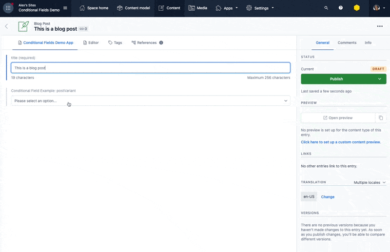

# Contentful Custom App: Entry Editor Conditional Fields Demo

Contentful doesn't offer an out-of-the box way to implement custom fields.
This repo is a demo implementation for conditional fields within an Entry Editor custom app.

The app uses a combination of default Contentful fields (rendered with [default-field-editors](https://contentful-field-editors.netlify.app/shared/default-field-editors)) and custom implementations of fields (rendered with [Forma 36](https://f36.contentful.com/) components) whose state is managed by this app.

The app code is in `/src/components/EntryEditor.tsx`

Conditional fields and their conditions are defined in the `conditionalFields.json` file.

## Demo (click .gif below to play)

In order to run a Contentful custom app, you'll need to have a Contentful account and an .env file in your local repo with your access tokens.

## Available Scripts

This project was bootstrapped with [Create Contentful App](https://github.com/contentful/create-contentful-app).

In the project directory, you can run:

#### `npm start`

Creates or updates your app definition in Contentful, and runs the app in development mode.
Open your app to view it in the browser.

The page will reload if you make edits.
You will also see any lint errors in the console.

#### `npm run build`

Builds the app for production to the `build` folder.
It correctly bundles React in production mode and optimizes the build for the best performance.

The build is minified and the filenames include the hashes.
Your app is ready to be deployed!

#### `npm run upload`

Uploads the build folder to contentful and creates a bundle that is automatically activated.
The command guides you through the deployment process and asks for all required arguments.
Read [here](https://www.contentful.com/developers/docs/extensibility/app-framework/create-contentful-app/#deploy-with-contentful) for more information about the deployment process.
